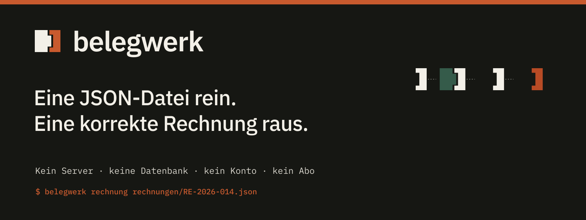

# belegwerk



[](https://github.com/Artaeon/belegwerk/actions/workflows/tests.yml)


**Dateien. Belege. Nachweis.** — das einfachste Rechnungswerkzeug für
österreichische kleine Unternehmen. Ein Ordner ist dein Unternehmen, eine JSON-Datei ist eine
Rechnung, ein Befehl setzt das PDF und führt ein manipulationsevidentes
Register. Kein Server-Zwang, keine Datenbank, kein Konto, kein Abo —
Dateien, die man versteht, und Git als Prüfpfad.

```
rechnungen/RE-2026-014.json  ──▶  belegwerk rechnung  ──▶  RE-2026-014.pdf
                                        │
                                        ▼
                              register.csv (SHA-256-Kette)
```

## Warum belegwerk

Für ein Unternehmen mit einer Handvoll Rechnungen im Monat ist ein
Buchhaltungsprogramm ein Werkzeugkasten, von dem man einen
Schraubenzieher benutzt — dafür zahlt man monatlich, pflegt ein Konto
und legt seine Belege in eine fremde Datenbank. belegwerk ist der
Schraubenzieher:

- **Korrekt per Konstruktion.** Die Pflichtangaben nach § 11 UStG sind
  Felder, keine Konvention. Fehlt eine, bricht das Werkzeug mit der
  vollständigen Liste — statt still eine unvollständige Rechnung
  auszustellen.
- **Nachweisbar per Konstruktion.** Jede Rechnung steht mit
  SHA-256-Prüfsumme im Register, jede Zeile ist mit der vorigen
  verkettet. Eine nachträglich geänderte oder gelöschte Zeile bricht die
  Kette aller folgenden. Die Prüfsumme steht auch auf der Rechnung:
  PDF und Register belegen einander.
- **100 % deins.** Firmendaten, Logo, Farben, Nummernkreis, Mahnfrist —
  alles in `firma.json`. Der Code ist offen (MIT): Das Register ist nur
  so viel wert, wie man dem Werkzeug glauben kann, das es führt.

## Schnellstart

```bash
git clone <repo> && cd belegwerk && bun install

mkdir ~/meine-firma && cd ~/meine-firma
bun <pfad>/src/belegwerk.mjs init        # firma.json ausfüllen
bun <pfad>/src/belegwerk.mjs rechnung rechnungen/RE-2026-001.json
```

Oder erst das Beispiel ansehen: `bun run beispiel` setzt eine
Muster-Rechnung mit gemischten Steuersätzen aus `beispiel/`.

## Befehle

| Befehl | Was er tut |
|---|---|
| `init` | Mandanten-Ordner anlegen (firma.json, rechnungen/, wiederkehrend/) |
| `rechnung <datei.json>` | Rechnung prüfen, als PDF setzen, ins Register eintragen |
| `storno <nummer>` | Stornorechnung mit eigener Nummer; das Original bleibt unangetastet |
| `wiederkehrend [JJJJ-MM]` | Monatsrechnungen aus `wiederkehrend/`-Vorlagen — idempotent |
| `bezahlt <nummer> [datum]` | Zahlungseingang vermerken |
| `offen` | Offene Forderungen mit Fälligkeit, Überfällige zuerst |
| `mahnung <nummer>` | Zahlungserinnerung/Mahnung als PDF — nie vor Fälligkeit |
| `konto <betrag> [datum]` | Kontostand manuell festhalten |
| `ausgabe <betrag> <text> [kategorie]` | Ausgabe notieren |
| `stand` | Überblick: Konto, offene Forderungen, Jahressummen, Ziele |
| `export [jahr]` | Jahres-CSV für die Steuerberatung: Netto, USt, Brutto, Status, Summen |
| `import <datei.csv>` | Altbestand aus dem Vorsystem ins Register übernehmen |
| `sichern [ziel]` | Datiertes, selbstprüfendes tar.gz des ganzen Mandanten |
| `pruefen` | Registerkette und Nummernkreis verifizieren |

## Eine Rechnung

```json
{
  "nummer": "RE-2026-014",
  "datum": "2026-07-29",
  "empfaenger": { "name": "Musterkunde GmbH", "adresse": "Beispielgasse 2, 1010 Wien" },
  "leistungszeitraum": "Juli 2026",
  "positionen": [
    { "text": "Website-Relaunch", "preis": 8400 },
    { "text": "Fachbuch", "menge": 2, "preis": 39, "ustSatz": 10 }
  ]
}
```

- Steuersätze je Position: 20 (Standard), 13, 10, 0
- `"steuerregel": "reverse-charge"` (§ 19) oder `"igl"` (steuerfreie
  ig Lieferung) — der vorgeschriebene Hinweis landet auf der Rechnung,
  die nötigen UIDs werden erzwungen. Unbekannte Regeln lehnt belegwerk ab.
- `"kleinunternehmer": true` in firma.json → keine USt, § 6-Hinweis
- `"muster": true` (oder „beispiel" im Dateinamen) → als Muster
  gekennzeichnet, kein Registereintrag
- Ab 10.000 € brutto verlangt § 11 UStG die UID des Empfängers —
  belegwerk auch, selbst beim Storno über −10.000 €.
- **Nummernkreis**: `"nummern": { "muster": "RE-{jahr}-{nr}", "breite": 3,
  "start": 100 }` in firma.json — `start` verschiebt den Beginn (etwa um
  einen Altbestand freizuhalten); sobald Nummern vergeben sind, zählt
  allein das Register.

## Umstieg und Steuerberatung

`belegwerk import altbestand.csv` (Kopfzeile
`nummer;datum;empfaenger;brutto`) übernimmt die Rechnungen des
Vorsystems ins Register: Nummernkreis und Vollständigkeit stimmen über
den Werkzeugwechsel hinweg, die Originalbelege bleiben im alten System
archiviert (BAO: 7 Jahre). Altbestand ist kein offener Posten und wird
hier nicht storniert — das tut das System, das ihn ausgestellt hat.

`belegwerk export 2026` schreibt die Jahres-CSV für die Steuerberatung:
je Rechnung Netto, USt, Brutto und Status (offen / bezahlt / storniert /
altbestand), am Ende die Summenzeile.

## Branding: dein Kit, deine Dokumente

Die Dokumente tragen das Branding des Mandanten, nicht das von
belegwerk. Drei Stufen, alle optional:

1. **Farben und Logo** — `firma.json`:
   ```json
   "stil": { "primaer": "#0B1F3A", "akzent": "#2558E8" },
   "logoPfad": "vorlage/logo.svg",
   "schriftPfad": "vorlage/schrift.woff2"
   ```
   Logo und Schrift werden eingebettet; die Pfade lösen relativ zum
   Mandanten-Ordner auf.
2. **Eigenes CSS** — `vorlage/stil.css` wird nach dem eingebauten Satz
   geladen und gewinnt die Kaskade.
3. **Eigener Kopf und Fuß** — `vorlage/kopf.html` und `vorlage/fuss.html`
   ersetzen die eingebauten Bausteine vollständig. Platzhalter:
   `{{logo}}`, `{{meta}}`, `{{name}}`, `{{adresse}}`, `{{uid}}`,
   `{{iban}}`, `{{email}}`, `{{web}}`.

Ein Branding-Kit (wie das der Stoicera Group) legt genau diese Dateien
in `vorlage/` ab — und jede Rechnung, jeder Storno, jede Mahnung trägt
das Kit. Wer kein eigenes Branding hat, nimmt die mitgelieferte
[Standardvorlage](vorlagen/standard/) in der belegwerk-Designsprache —
IBM Plex, Werkorange, Registergrün, ohne belegwerk-Logo.

Die Marke des Werkzeugs selbst (Logos, Tokens, Guide, GitHub-Assets)
liegt unter [`brand/`](brand/).

## Die Regeln, die das Werkzeug durchsetzt

1. **Eine ausgestellte Rechnung wird nie geändert.** Dieselbe Nummer mit
   anderen Daten wird verweigert, bevor ein PDF entsteht — storniert und
   neu ausgestellt wird stattdessen.
2. **Nummern kommen aus dem Register**, nicht aus einem zweiten Zähler,
   der auseinanderlaufen könnte. `pruefen` findet Doppel und Lücken.
3. **Gemahnt wird nie vor Fälligkeit**, und versendet wird von Hand —
   der Server erinnert den Menschen, nicht den Kunden.
4. **Der Überblick ordnet sich selbst ein**: `stand` ist eine
   Arbeitshilfe, keine Buchhaltung.

## Auf dem Server

Kein Webdienst — kein Port, keine Anmeldung, keine Angriffsfläche. Auf
dem Server ist belegwerk ein privates Git-Repo je Mandant, ein
systemd-Timer stellt am Monatsersten die wiederkehrenden Rechnungen aus
und pusht; der Push ins Remote **ist** die 7-Jahre-Aufbewahrung (BAO).
Für alle ohne Git: `belegwerk sichern` erzeugt ein datiertes,
selbstprüfendes Archiv fürs zweite Medium. Ein Wochen-Cron mailt
Registerprüfung und Forderungsbericht. Anleitung und Unit-Dateien:
[`deploy/SERVER.md`](deploy/SERVER.md) · Datenschutz (lokal, keine
Telemetrie, Rollen nach DSGVO, Löschfristen):
[`DATENSCHUTZ.md`](DATENSCHUTZ.md).

## Rechtliches, ehrlich

[`ANFORDERUNGEN.md`](ANFORDERUNGEN.md) ist das lebende Register: was
belegwerk erfüllt (§ 11 UStG, BAO-Ordnungsmäßigkeit, Sonderfälle mit
Hinweispflicht), was bewusst draußen ist (Registrierkasse/RKSV — nur
Barumsätze; keine Doppik; keine Steuerberatung) und was offen ist
(strukturierte E-Rechnung ebInterface/EN 16931 — Pflicht heute nur
gegenüber dem Bund, ab 2030 innergemeinschaftlich; UVA-Zuarbeit;
BMD-Export). Mit Quellen und Datum, damit es altern darf, ohne zu lügen.

## Sicherheit

Die Angriffsflächen sind einzeln zugenagelt und einzeln getestet:

- **HTML-Injection ins PDF**: Alle Werte werden vollständig entschärft —
  auch Anführungszeichen, denn Werte landen in Attributen. Ein
  Empfängername ist Text, nie Markup.
- **Excel-Formel-Injection im Export**: Namen, die mit `=`, `+`, `-`
  oder `@` beginnen, bekommen den Text-Apostroph — die CSV geht an die
  Steuerberatung, deren Excel führt keine fremden Formeln aus.
- **Pfad-Traversal beim Import**: Rechnungsnummern werden Dateinamen —
  zulässig sind nur Buchstaben, Ziffern, Punkt, Binde- und Unterstrich.
- **Register-Integrität**: Feldtrenner und Zeilenumbrüche in Werten
  werden abgelehnt; die Hash-Kette deckt jede Zeile vollständig ab;
  gleichzeitige Läufe sperrt `register.csv.lock` atomar.
- **Beträge sind Zahlen**: Ein Preis, der keine Zahl ist, wird
  abgelehnt — es gibt keine Rechnung über „NaN €".
- **CSS-Injection über die Konfiguration**: Farben in `firma.json`
  müssen Hex sein — sie landen wörtlich im Stylesheet.
- **Pfad-Ausbruch bei Logo und Schrift**: `logoPfad`/`schriftPfad`
  müssen im Mandanten-Ordner liegen — ein übernommenes Branding-Kit
  bettet keine fremden Dateien ein.
- **Kein falscher Alarm**: Windows-Zeilenenden (CRLF) im Register sind
  keine Manipulation und lösen keinen aus — echte Änderungen weiterhin.
- **Keine Netzfläche**: kein Port, keine Telemetrie, keine externen
  Ressourcen im PDF — siehe [DATENSCHUTZ.md](DATENSCHUTZ.md).

## Testen

```bash
bun test             # Unit + End-to-End: jede CLI-Funktion im Wegwerf-Mandanten
bun test --coverage  # Zeilenabdeckung der Bibliotheken
```

Die Suite deckt auch die Fehlerwege ab: fehlende Pflichtangaben,
manipulierte Register, doppelte Storni, Mahnung vor Fälligkeit.

## Copyright und Lizenz

© 2026 [Stoicera Group](https://stoicera.com) — erstellt und gepflegt
von der Stoicera Group, Österreich. Open Source unter MIT-Lizenz,
siehe [LICENSE](LICENSE).
